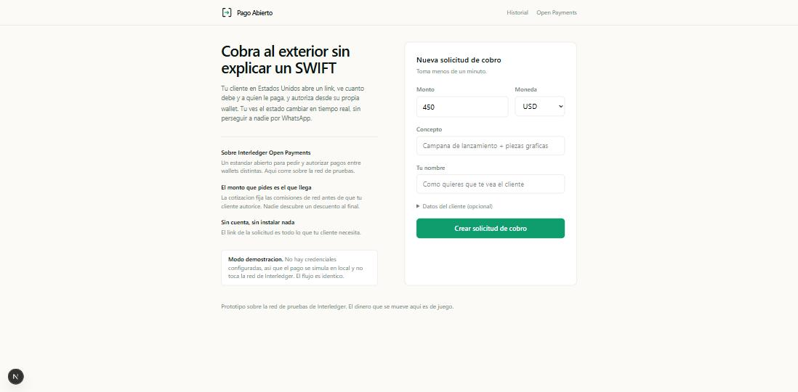
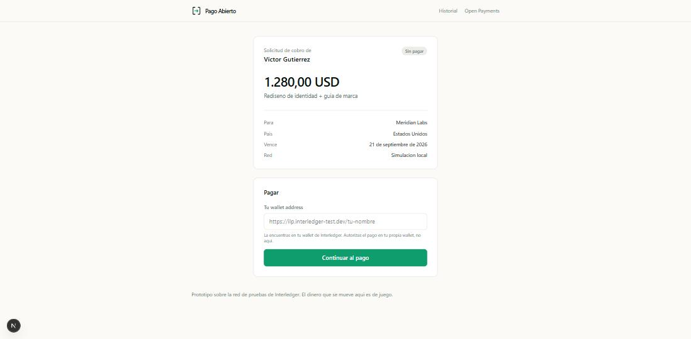
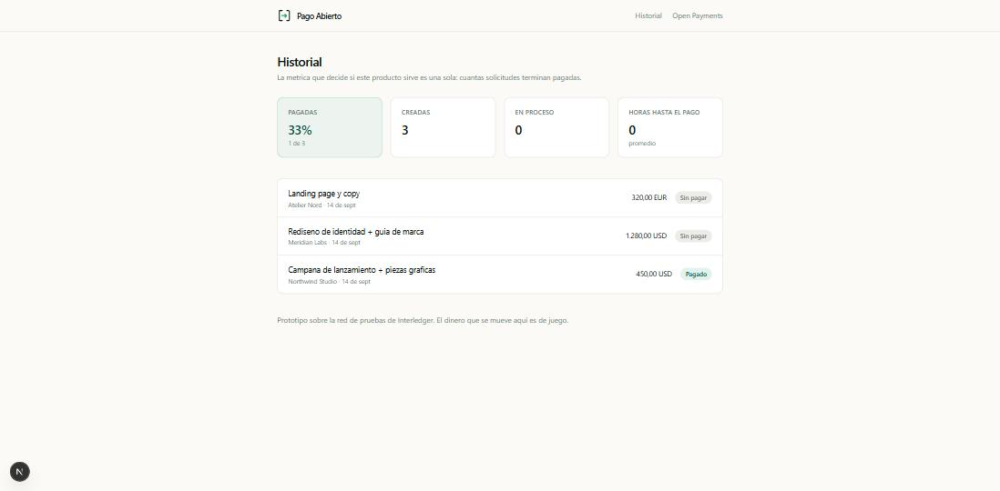

# Pago Abierto

**Cobra al exterior sin explicar un SWIFT.** Solicitudes de cobro cross-border
sobre [Interledger Open Payments](https://openpayments.dev), para freelancers en
LATAM que facturan a clientes en Estados Unidos y Europa.

---

## El problema

Un freelancer en Colombia le factura USD 450 a un cliente en Estados Unidos. El
cliente pregunta *"¿cómo te pago?"* y ahí empieza el problema: la transferencia
tarda entre dos y cinco días hábiles, los intermediarios descuentan una comisión
que nadie ve hasta que el dinero llega, y el cliente tiene que pedirle a su banco
un SWIFT con datos que no entiende.

El resultado no es solo la demora. Es que el freelancer queda pidiendo disculpas
por un proceso que no controla, frente a un cliente que ya pagó.

Pago Abierto reemplaza eso por un link: el cliente ve cuánto debe, a quién le
paga y en qué estado va, y autoriza desde su propia wallet.



## Qué hace

- Crear una solicitud de cobro con monto, moneda y concepto.
- Una pantalla pública de pago, sin cuenta ni instalación para el cliente.
- Autorización real vía Open Payments: cotización, consentimiento y pago.
- Historial con el embudo `created → pending → paid`.

<p align="center">
  
  
</p>

**Métrica norte:** el porcentaje de solicitudes que llegan a `paid`. Lo que se
está probando es la claridad, no la tecnología — Interledger es el medio, no la
propuesta de valor. El razonamiento completo está en
[`docs/lean.md`](docs/lean.md).

## Correrlo en un minuto

No hace falta ninguna credencial. Sin ellas la app usa un proveedor simulado que
imita el flujo completo, incluida la pantalla de consentimiento.

```bash
git clone https://github.com/vicguty25/pago-abierto-mvp
cd pago-abierto-mvp
npm install
cp .env.example .env.local     # solo hay que completar DATABASE_URL
npm run db:push
npm run dev
```

Necesitas un Postgres. Cualquiera sirve: uno local, o el free tier de Supabase o
Neon.

Para conectar la red de pruebas real y ver dinero de juego moviéndose entre dos
wallets, sigue [`docs/open-payments-setup.md`](docs/open-payments-setup.md).

## Cómo funciona

```
1. CREAR     grant incoming-payment  →  cobro abierto en la wallet que recibe
2. PAGAR     grant quote → quote → grant outgoing-payment (interactivo)
             →  redirect a la pantalla de consentimiento de la wallet del cliente
3. VOLVER    continue grant → outgoing payment → leer receivedAmount
4. MEDIR     embudo created → pending → paid
```

El detalle de cada paso, y las tres cosas que no son obvias del protocolo, están
en [`docs/architecture.md`](docs/architecture.md).

### El adaptador

La aplicación nunca importa el SDK directamente. Habla con la interfaz
`PaymentProvider`, y hay dos implementaciones detrás:

```
lib/payments/
├── types.ts     el contrato
├── testnet.ts   @interledger/open-payments contra la red real
├── mock.ts      sin red, para correr el repo sin credenciales
└── index.ts     elige según el entorno
```

Así el repositorio se puede evaluar antes de configurar nada, y el código que se
demuestra es exactamente el mismo que corre contra la red real.

## Stack

| | |
|---|---|
| Framework | Next.js 16 (App Router), TypeScript |
| Estilos | Tailwind CSS v4 |
| Datos | Postgres + Drizzle ORM |
| Pagos | `@interledger/open-payments` 7.4.0 |
| Validación | Zod |

El SDK firma con HTTP Message Signatures sobre `node:crypto`, así que los route
handlers que lo tocan corren en runtime Node, nunca en edge.

## Estructura

```
app/
├── page.tsx                       crear solicitud
├── p/[slug]/page.tsx              pantalla pública de pago
├── p/[slug]/return/route.ts       retorno del consentimiento
├── dashboard/page.tsx             historial y embudo
├── mock-wallet/consent/           consentimiento simulado
└── api/requests/                  crear y preparar pagos
lib/payments/                      el adaptador
db/schema.ts                       payment_requests + payment_events
docs/                              lean, marca, arquitectura, setup
```

## Lo que no hace

Está en el [anti-scope](docs/lean.md#anti-scope) y es a propósito: no hay KYC
real, ni conversión a moneda local, ni multi-moneda, ni facturación fiscal, ni
autenticación — el slug de la URL es la credencial, lo que mantiene el flujo
feliz por debajo de tres minutos y es lo primero que habría que cambiar si el
producto avanza.

Corre sobre la red de pruebas de Interledger. El dinero que se mueve aquí es de
juego.

## Marca

Papel claro, tinta densa, un solo acento verde. Va al revés del fintech oscuro
con degradados a propósito: quien abre la pantalla de pago es un cliente que no
conoce la marca y está a punto de mover dinero. Parecer documento funciona mejor
que parecer software. El razonamiento está en [`docs/brand.md`](docs/brand.md).

---

Construido por [Víctor Gutiérrez](https://github.com/vicguty25) para el
Interledger Open Payments Hackathon — Medellín, octubre 2026.

Licencia MIT.
